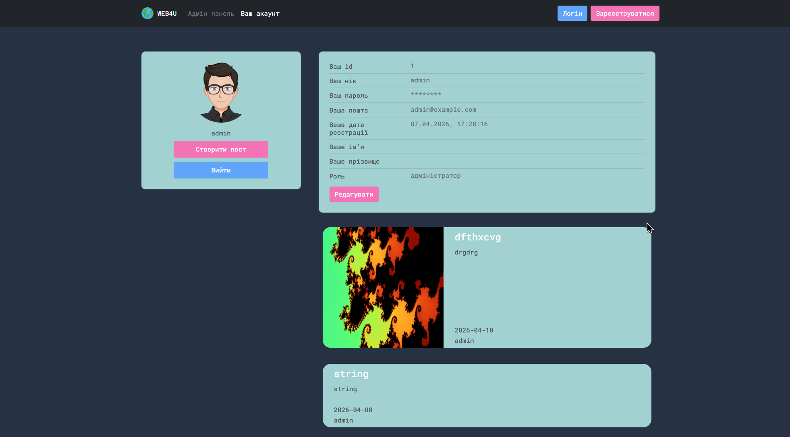
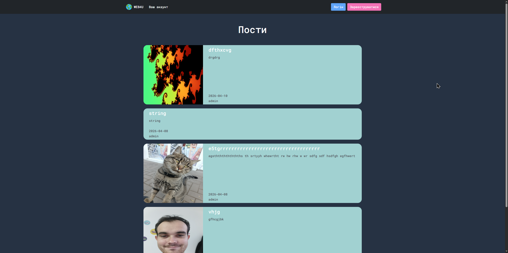
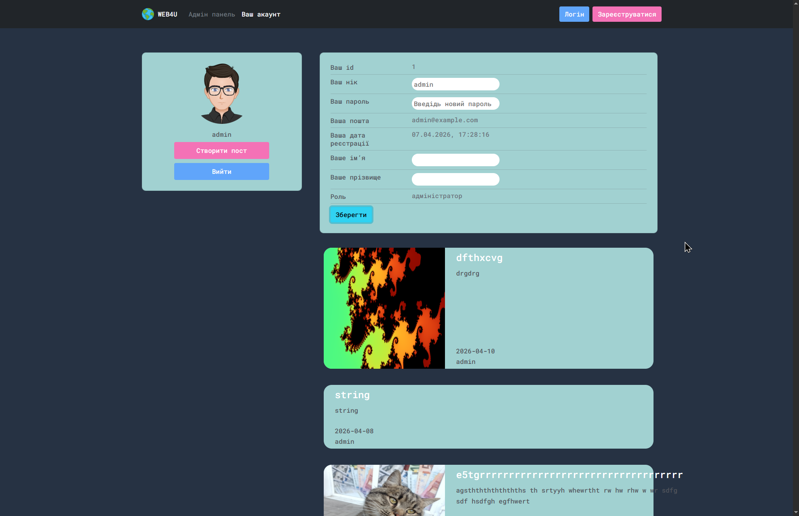
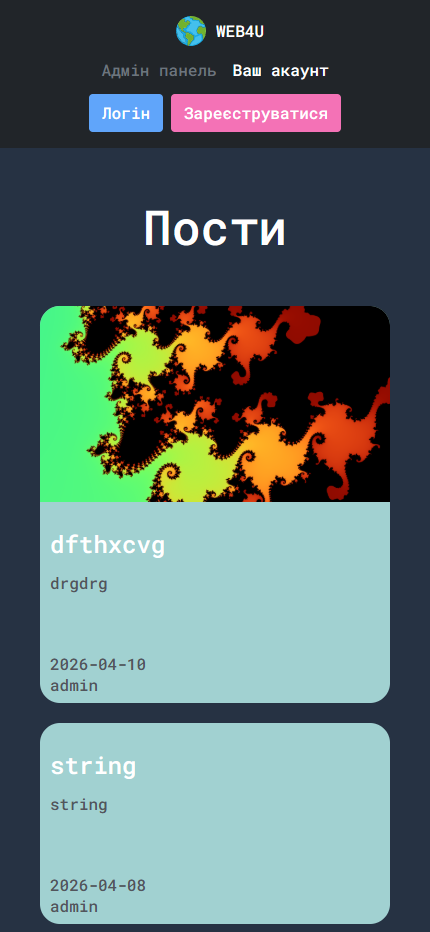
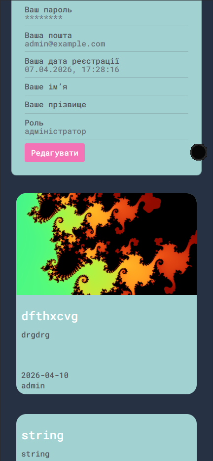
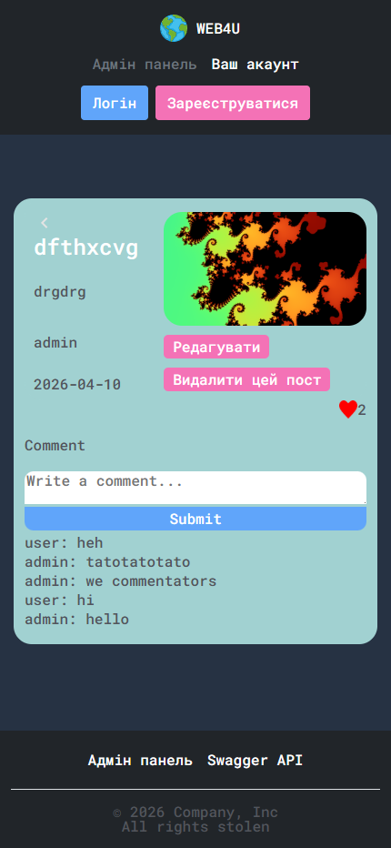

# Web4U

**Web4U** — це проста соціальна мережа, створена на Django як pet-проєкт.  
Користувачі можуть реєструватися, створювати пости, коментувати їх та ставити лайки.

Проєкт включає REST API, Swagger-документацію, PostgreSQL, Docker та підтримку статичних і медіафайлів.

---

## Основні можливості

- Реєстрація та аутентифікація користувачів
- CRUD операції для постів
- Коментарі до постів
- Система лайків
- REST API
- Swagger документація
- Docker + Docker Compose
- PostgreSQL (Docker) або SQLite (локально)
- Автоматичне застосування міграцій
- Підтримка static/media через volumes

---

## Технології

- Python / Django
- Django REST Framework
- PostgreSQL
- Docker
- Swagger (drf-yasg)


### В майбутньому буде ще:

- React.js
- Nginx
- хостинг
- і багато іншого...

---

## Запуск проєкту

### Клонувати репозиторій

```bash
git clone https://github.com/555hehe555/Web4U.git
cd web4u
```

### Створення .env
```bash
cp .env.example .env
```
або 
```bash
copy .env.example .env
```

### І далі в заледності як ви захочите запускати проєкт:

- [Чи ви хочете запустити локально](guide/start_local.md)
- [Чи ви хочете запустити через Docker](guide/start_docker.md)

---

## Фотографії








### [І інші фото](examples/)

---

## Наші активні завдання
- [тут](guide/todo.md)

## Автори

- [555hehe555](https://github.com/555hehe555)
- [VaILeo](https://github.com/Valerii-Postrybailo)
